# Wanderlust - Your Ultimate Travel Blog 🌍✈️

WanderLust is a simple MERN travel blog website ✈ This project is aimed to help people to contribute in open source, upskill in react and also master git.


## [Figma Design File](https://www.figma.com/file/zqNcWGGKBo5Q2TwwVgR6G5/WanderLust--A-Travel-Blog-App?type=design&node-id=0%3A1&mode=design&t=c4oCG8N1Fjf7pxTt-1)
## [Discord Channel](https://discord.gg/FEKasAdCrG)

## 🎯 Goal of this project

At its core, this project embodies two important aims:

1. **Start Your Open Source Journey**: It's aimed to kickstart your open-source journey. Here, you'll learn the basics of Git and get a solid grip on the MERN stack and I strongly believe that learning and building should go hand in hand.
2. **React Mastery**: Once you've got the basics down, a whole new adventure begins of mastering React. This project covers everything, from simple form validation to advanced performance enhancements. And I've planned much more cool stuff to add in the near future if the project hits more number of contributors.

_I'd love for you to make the most of this project - it's all about learning, helping, and growing in the open-source world._

## 🛠️ Project Workflow & CI/CD Architecture

The Wanderlust project follows a modern DevOps lifecycle, ensuring code quality, security, and automated deployments.




### 🚀 Workflow Steps:
1.  **Code Commit**: Developers push changes to the GitHub repository.
2.  **Jenkins Trigger**: Jenkins automatically detects changes and starts the build.
3.  **SonarQube Security**: Static analysis checks for code smells, bugs, and security vulnerabilities.
4.  **Security Scanning**: 
    - **OWASP**: Scans for known vulnerabilities in third-party dependencies.
    - **Trivy**: Performs a deep scan of the filesystem and Docker images for OS-level vulnerabilities.
5.  **Automated Build**: Docker Compose builds fresh, optimized images for both the Frontend and Backend.
6.  **Containerized Deployment**: The application is deployed as a multi-container stack, isolated and scalable.

## Setting up the project locally

### Setting up the Backend

1. **Fork and Clone the Repository**

   ```bash
   git clone https://github.com/{your-username}/wanderlust.git
   ```

2. **Navigate to the Backend Directory**

   ```bash
   cd backend
   ```

3. **Install Required Dependencies**

   ```bash
   npm i
   ```

4. **Set up your MongoDB Database**

   - Open MongoDB Compass and connect MongoDB locally at `mongodb://localhost:27017`.

5. **Import sample data**

   > To populate the database with sample posts, you can copy the content from the `backend/data/sample_posts.json` file and insert it as a document in the `wanderlust/posts` collection in your local MongoDB database using either MongoDB Compass or `mongoimport`.

   ```bash
   mongoimport --db wanderlust --collection posts --file ./data/sample_posts.json --jsonArray
   ```

6. **Configure Environment Variables**

   ```bash
   cp .env.sample .env
   ```

   > **Important**: For detailed environment setup instructions, including port configurations and troubleshooting, please refer to [SETUP.md](./SETUP.md).

7. **Start the Backend Server**

   ```bash
   npm start
   ```

   > You should see the following on your terminal output on successful setup.
   >
   > ```bash
   > [BACKEND] Server is running on port 5001
   > [BACKEND] Database connected: mongodb://127.0.0.1/wanderlust
   > ```

### Setting up the Frontend

1. **Open a New Terminal**

   ```bash
   cd frontend
   ```

2. **Install Dependencies**

   ```bash
   npm i
   ```

3. **Configure Environment Variables**

   ```bash
   cp .env.sample .env
   ```

   > **Important**: Ensure the `VITE_API_PATH` is set to `http://localhost:5001` to match the backend port. Refer to [SETUP.md](./SETUP.md) for complete configuration details.

4. **Launch the Development Server**

   ```bash
   npm run dev
   ```

## 🌟 Ready to Contribute?

Kindly go through [CONTRIBUTING.md](https://github.com/krishnaacharyaa/wanderlust/blob/main/.github/CONTRIBUTING.md) to understand everything from setup to contributing guidelines.

## 💖 Show Your Support

If you find this project interesting and inspiring, please consider showing your support by starring it on GitHub! Your star goes a long way in helping me reach more developers and encourages me to keep enhancing the project.

🚀 Feel free to get in touch with me for any further queries or support, happy to help :)
